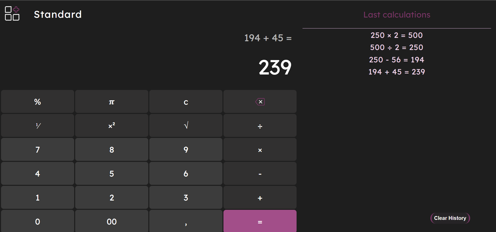
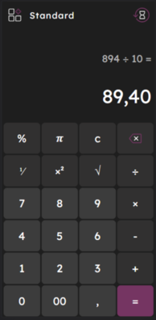
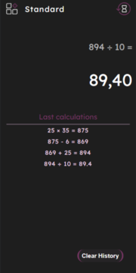

# Simple calculator

## Description 💻

This is a simple calculator created in HTML, CSS and JavaScript. It allows users
to perform basic mathematical operations such as addition, subtraction,
multiplication and division. It also includes percentages, a number to the power
of 2, the square root of two, and the fraction ⅟x. The calculator also contains
a history of mathematical operations that can also be deleted.

## Table of contents 🗒️

- [Table of contents](#table-of-contents)
- [Screenshots](#screenshots)
- [Status](#status)
- [Inspiration](#inspiration)
- [Technologies](#technologies)
- [How to Run the Website Locally](#how-to-run-the-website-locally)
- [Contribution](#contribution)
- [Code Quality Checks](#code-quality-checks)
- [Links](#links)
- [Contact](#contact)

## Screenshots 📸

---

## Status ⌛

Project is: _done_

## Inspiration 💭

Project inspired by windows calculator

## Technologies 🖥️

The calculator was built using the following technologies:

- HTML
- CSS
- Git
- Node 19.4.0
- JavaScript

The calculator is responsive and works on different devices, including
computers, tablets, and smartphones.

## How to Run the Website Locally 📂

To run the calculator locally on your computer, follow these steps:

1. Make sure you have Node.js installed on your computer.
2. Clone the GitHub repository (link to clone)
3. Navigate to the hack-your-future-belgium directory in your terminal.
4. Run the command `npm install` to install the required packages.
5. Run the command `npm start` to start the server and open the website in your
   browser.

## Contribution ❤️

If you want to contribute to this project or make some improvements, you can
follow these steps:

Clone the repository to your local computer. Make changes and improvements to
the code. Do some tests to make sure everything is working properly. Submit a
pull request to submit your changes.

## Code Quality Checks ✔️

- `npm run format`: Makes sure all the code in this repository is well-formatted
  (looks good).
- `npm run format:check`: Checks the code formatting in the project without
  making any actual changes. It verifies if the code follows a specified
  formatting style, such as indentation, spacing, and line breaks. It helps
  ensure code consistency and adherence to the defined coding standards.
- `npm run lint:js`: Checks for any syntax errors, coding style violations, or
  potential bugs. It enforces a consistent code style and helps identify and fix
  issues early in the development process.
- `npm run lint:ls`: Checks to make sure all folder and file names match the
  repository conventions.
- `npm run lint:md`: Will lint all of the Markdown files in this repository.
- `npm run spell-check`: Goes through all the files in this repository looking
  for words it doesn't recognize. Just because it says something is a mistake
  doesn't mean it is! It doesn't know every word in the world. You can add new
  correct words to the [./.cspell.json](./.cspell.json) file so they won't cause
  an error.

## Links 🌐

[Repo](https://github.com/Mileenka/Calculator)

[Live](https://mileenka.github.io/Calculator/)

## Contact 💌

| [GitHub](https://github.com/Mileenka) |

If you have any questions or comments about the project, please contact me at
[Slack](https://mileenka.slack.com).
